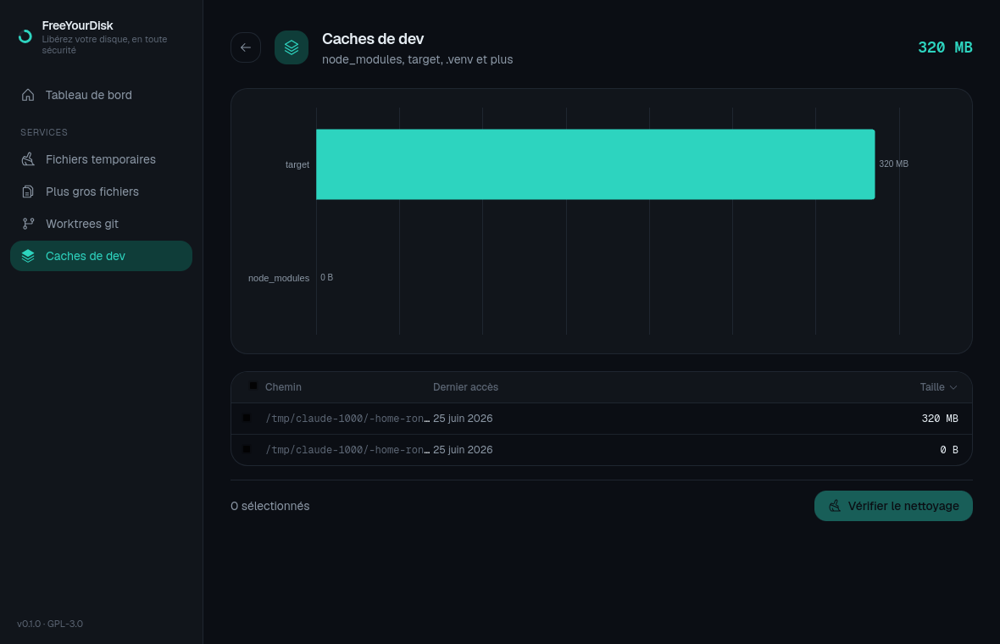

# FreeYourDisk

> Libérez votre disque, en toute sécurité.

[English](README.md) · **Français**

Un utilitaire desktop Linux moderne qui analyse votre disque et nettoie **en
toute sécurité** les fichiers temporaires, les fichiers volumineux, les
worktrees git obsolètes et les caches de développement — avec un tableau de bord
visuel, des graphes, et une suppression **récupérable par défaut**.

Construit avec **Tauri** (cœur Rust + WebView), licence **GPL-3.0-or-later**.


---

## Fonctionnalités

- **Fichiers temporaires** — vieux fichiers dans `/tmp`, `/var/tmp` et
  `~/.cache`, filtrés par âge.
- **Plus gros fichiers et dossiers** — un explorateur en lecture seule de ce qui
  prend le plus de place, visualisé en treemap.
- **Worktrees git** — détecte les worktrees liés propres ou élaguables pour
  récupérer leur espace. **Ne touche jamais à un worktree avec des modifications
  non commitées.**
- **Caches de dev** — `node_modules`, `target/` Rust, `.next`, `.turbo`,
  `.venv`, `vendor/` PHP et plus, détectés par signature.
- **Tray système** — l'app vit dans le tray ; son menu ouvre un widget popover
  avec un résumé de l'espace disque et une action rapide.



## Modèle de sécurité

FreeYourDisk repose sur cinq invariants non négociables :

1. **Scans en lecture seule** — analyser ne modifie jamais le système de
   fichiers (vérifié par des tests).
2. **Dry-run d'abord** — toute suppression affiche un aperçu exact (nombre,
   taille, destination) et exige une confirmation explicite.
3. **Corbeille par défaut** — les fichiers vont dans la corbeille XDG
   récupérable ; la suppression définitive est un opt-in explicite, par action.
4. **Whitelist de zones** — les suppressions sont validées contre des zones
   autorisées ; les chemins hors zones et les symlinks qui s'en échappent sont
   refusés.
5. **Git-safe** — les actions git ne suppriment jamais de travail non commité.

### Moindre privilège

L'UI tourne en utilisateur normal, **sans aucun privilège**. Quand une action
requiert root (ex. `/var/tmp`), un **helper minimal** est invoqué via
**Polkit** — la WebView ne tourne jamais en root.

## Stack technique

| Couche       | Choix                                               |
| ------------ | --------------------------------------------------- |
| Shell app    | Tauri 2 (cœur Rust + WebView)                       |
| Backend      | Workspace Rust (`core-scan`, `core-trash`, `core-services`, `core-ipc`, `privhelper`) |
| Frontend     | Svelte 5 + TypeScript + Vite 6                      |
| Style        | Tailwind CSS v4 (`@theme` CSS-first)                |
| Graphes      | Apache ECharts                                      |
| Privilèges   | Polkit / `pkexec` + binaire helper dédié            |

## Compiler depuis les sources

### Prérequis (Debian / Ubuntu)

```bash
sudo apt install -y libwebkit2gtk-4.1-dev build-essential curl wget file \
  libxdo-dev libssl-dev libayatana-appindicator3-dev librsvg2-dev libgtk-3-dev cmake
# Rust (https://rustup.rs) et Node 22+ / pnpm sont aussi requis.
cargo install tauri-cli
```

### Lancer en développement

```bash
cd ui && pnpm install && cd ..
cargo tauri dev
```

### Construire un binaire / .deb

```bash
cd ui && pnpm build && cd ..
cargo tauri build          # produit un binaire standalone et un .deb
```

Le binaire standalone est dans `target/release/freeyourdisk`.

## Organisation du projet

```
crates/
  core-ipc/        DTOs partagés (le contrat back/front)
  core-scan/       scan parallèle du système de fichiers, lecture seule
  core-trash/      corbeille XDG + suppression définitive, whitelist de zones
  core-services/   les quatre services de nettoyage
  privhelper/      helper privilégié minimal (Polkit)
src-tauri/         app Tauri : commandes, routage d'exécution, tray
ui/                frontend Svelte
```

## Licence

[GPL-3.0-or-later](LICENSE).
