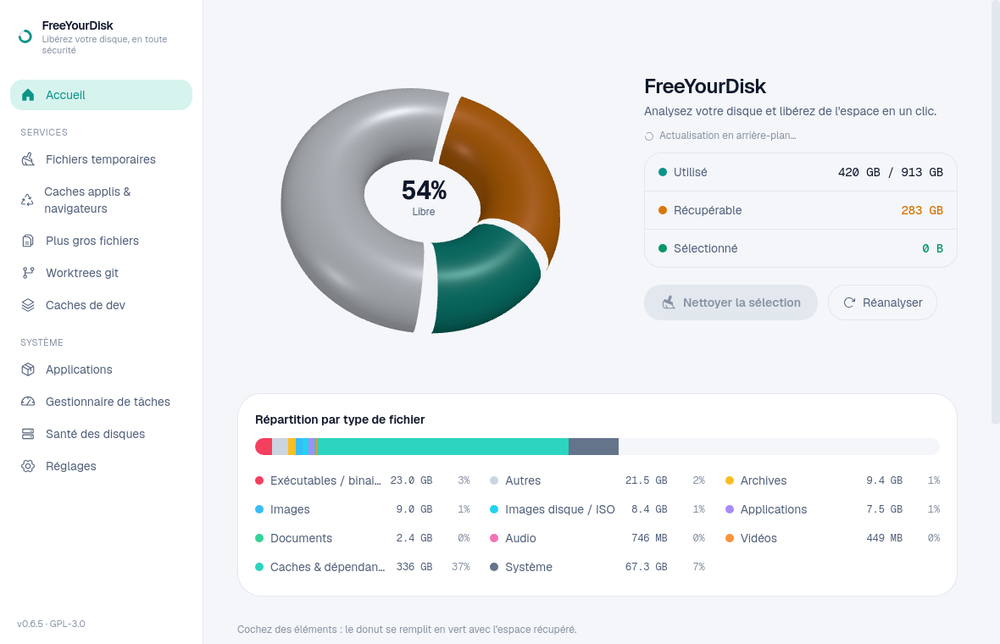
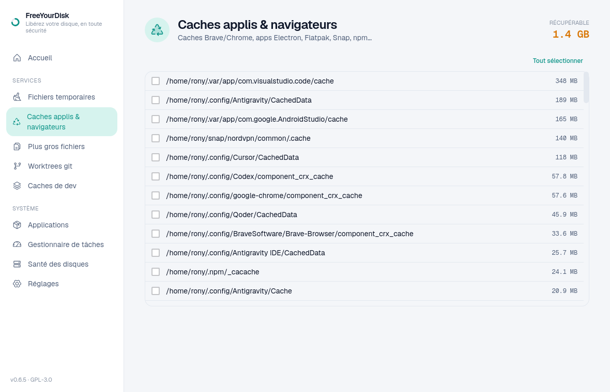
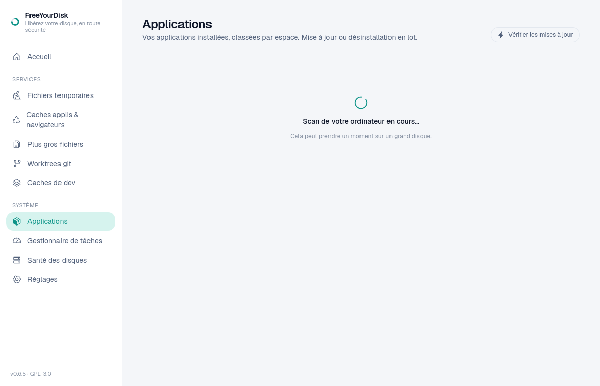

# FreeYourDisk

> Libérez votre disque, en toute sécurité.

[English](README.md) · **Français**

Un utilitaire de bureau moderne pour **Linux, Windows et macOS** qui analyse votre disque et **libère de
l'espace en toute sécurité** : fichiers temporaires, gros fichiers, worktrees
git obsolètes, caches de dev, **applications installées** et **répartition par
type de fichier** — autour d'un donut 3D d'utilisation, avec un modèle de
suppression récupérable par défaut.

Construit avec **Tauri** (cœur Rust + WebView), sous licence **GPL-3.0-or-later**.



---

## Fonctionnalités

### Accueil — scan unifié en un clic

- Un **donut 3D** (three.js) montrant l'espace utilisé / récupérable / libre.
- **Scanner maintenant** lance tous les scans + la répartition par type d'un
  coup et remplit le donut : une couche **or** pour le récupérable et une couche
  **verte** qui grandit au fur et à mesure de la sélection, avec les chiffres en
  direct.
- Les résultats sont groupés par catégorie (repliables) ; le total
  « récupérable » global est toujours égal à la somme des catégories et ne
  dépasse jamais le disque.

### Catégories de nettoyage

- **Fichiers temporaires** — `/tmp`, `/var/tmp` et `~/.cache`, agrégés par
  dossier de cache et filtrés par âge.
- **Plus gros fichiers et dossiers** — un explorateur lecture seule de ce qui
  prend le plus de place (dossiers de cache/apps exclus — ils ont leurs propres
  sections).
- **Worktrees git** — worktrees liés propres ou élagables. **Ne touche jamais à
  un worktree avec des modifications non commitées.**
- **Caches de dev** — `node_modules`, `target/` Rust, `.next`, `.turbo`,
  `.venv`, `vendor/` PHP et plus.
- **Caches applis & navigateurs** — les caches régénérables que le balayage de
  `~/.cache` rate : caches Chromium/Electron sous `~/.config`, Flatpak
  (`~/.var/app/*/cache`), Snap et npm/yarn/bun.



### Répartition par type de fichier

Une barre de distribution cliquable qui couvre **tout le disque** : images,
vidéos, audio, archives, images disque / ISO, applications, exécutables,
documents, **caches & dépendances**, **système** et **réservé (filesystem)**.
Cliquez une catégorie pour lister ses plus gros fichiers avec leurs chemins. La
taille du système est mesurée précisément (via `du` : déduplication des
hardlinks, taille en blocs, un seul filesystem), donc la réserve ext4 est
affichée honnêtement au lieu de gonfler « Système ».

### Applications

Inventaire des applications installées depuis les gestionnaires Linux et les
**AppImages**, le registre/MSIX Windows et les bundles macOS `.app`. L’ouverture
de cette vue charge uniquement l’inventaire : elle ne lance ni calcul récursif de
la taille des dossiers d’applications ni vérification réseau des mises à jour.
Les dossiers d’applications restent donc visibles avec une taille non calculée,
ce qui préserve la réactivité même lorsqu’ils contiennent beaucoup de fichiers.

La vérification des mises à jour est déclenchée explicitement avec le bouton
prévu dans l’interface. Lorsqu’ils sont disponibles sur le système, les
gestionnaires de paquets affichent leur fournisseur et leurs versions : **apt**,
**flatpak**, **snap**, **winget** et les formules/casks Homebrew. Les AppImages
et bundles `.app` copiés manuellement restent visibles avec leur motif, sans
action de mise à jour trompeuse puisqu’ils n’ont pas de canal sûr standard. Les
paquets système essentiels sont **protégés** (mise à jour seule,
désinstallation bloquée). Les dossiers d’applications sont exclus des autres
scans.



### Santé des disques

SMART par disque (état, heures d'allumage, température) via **nvme-cli** pour les
disques NVMe (ou `smartctl` pour le SATA), plus des **graphes de débit
lecture/écriture en temps réel** et la disponibilité du système. Les outils
manquants sont détectés selon la machine et installables en **un clic** via votre
gestionnaire de paquets (apt / dnf / pacman / zypper).

### Gestionnaire de tâches

Un gestionnaire de processus de crise intégré : un **graphe CPU / RAM / swap en
temps réel**, une **heatmap d'utilisation par cœur**, la **température** CPU, et
une **table de processus** triable/filtrable avec terminer / forcer / redémarrer
et un **« tuer le plus gros »** en un clic (plus gros consommateur de RAM hors
process critiques). Un **raccourci global configurable** (défaut `Ctrl+Alt+Suppr`)
fait surgir la fenêtre sur le gestionnaire ; l'app augmente sa priorité et demande
l'immunité OOM pour rester réactive sous pression mémoire.

### Réglages, planification & surveillance

- Thème **clair / sombre / système** et langue **français / anglais / système**.
- **Lancement au démarrage** de la session (XDG autostart).
- **Surveillance de l'espace disque** — un veilleur en arrière-plan affiche une
  pop-up avec un CTA de nettoyage quand l'espace libre passe sous un seuil
  configurable.
- **Nettoyage planifié** — un timer systemd utilisateur hebdomadaire.

### Incrémental & instantané

- Un **cache de tailles de dossiers validé au `mtime`** et persisté : les arbres
  inchangés (`node_modules`, caches) ne sont pas re-parcourus, donc les rescans
  sont rapides.
- À l'ouverture, l'app affiche **instantanément les derniers résultats** depuis
  le cache, puis se rafraîchit en arrière-plan et **met en avant ce qui est
  nouveau** depuis la dernière fois.

### Icône de la barre des tâches

Quand la session de bureau fournit un tray compatible, son menu ouvre un widget
popover avec un résumé de l'utilisation disque et une action rapide. Sans tray
(notamment sur certaines sessions Linux), FreeYourDisk démarre quand même et la
fermeture de la fenêtre principale la ferme normalement au lieu de la masquer
sans moyen de la restaurer.

## Modèle de sécurité

FreeYourDisk repose sur cinq invariants non négociables :

1. **Scans en lecture seule** — l'analyse ne modifie jamais le système de
   fichiers (garanti par les tests).
2. **Dry-run d'abord** — chaque suppression montre un aperçu exact (nombre,
   taille, destination) et exige une confirmation explicite.
3. **Corbeille par défaut** — les fichiers vont dans la corbeille XDG
   récupérable ; la suppression définitive est un opt-in explicite par action.
4. **Liste blanche de zones** — les suppressions sont validées contre des zones
   autorisées ; les chemins hors zone et les symlinks qui s'en échappent sont
   refusés.
5. **Git-safe** — les actions git ne suppriment jamais de travail non commité.

### Moindre privilège

L'interface tourne en utilisateur normal **sans privilèges**. Quand une action
nécessite une élévation (ex. `/var/tmp`, SMART ou paquets gérés), un **helper
minimal** est invoqué par le mécanisme de la plateforme : Polkit / `pkexec` sous
Linux, UAC sous Windows et dialogue administrateur natif sous macOS. La WebView
elle-même ne tourne jamais en root ou administrateur.

## Stack technique

| Couche      | Choix                                                                                 |
| ----------- | ------------------------------------------------------------------------------------- |
| Coquille    | Tauri 2 (cœur Rust + WebView)                                                         |
| Backend     | Workspace Rust (`core-scan`, `core-trash`, `core-services`, `core-ipc`, `privhelper`) |
| Frontend    | Svelte 5 + TypeScript + Vite 6                                                        |
| Styles      | Tailwind CSS v4 (config CSS-first `@theme`, clair/sombre)                             |
| Graphiques  | Apache ECharts (graphes) + three.js (donut 3D)                                       |
| Privilèges  | Polkit / `pkexec` + binaire helper dédié                                              |

## Compiler depuis les sources

### Prérequis (Debian / Ubuntu)

```bash
sudo apt install -y libwebkit2gtk-4.1-dev build-essential curl wget file \
  libxdo-dev libssl-dev libayatana-appindicator3-dev librsvg2-dev libgtk-3-dev cmake
# Recommandé pour la section Santé des disques :
sudo apt install -y nvme-cli smartmontools
# Rust (https://rustup.rs) et Node 22+ / pnpm sont aussi requis.
cargo install tauri-cli
```

### Lancer en développement

```bash
cd ui && pnpm install && cd ..
cargo build --release -p freeyourdisk-helper   # le helper privilégié (SMART, suppressions root)
cargo tauri dev
```

### Construire une release / .deb / .rpm / .AppImage

```bash
cd ui && pnpm build && cd ..
cargo build --release -p freeyourdisk-helper
cargo tauri build          # produit les bundles deb, rpm et AppImage
```

Le binaire autonome est dans `target/release/freeyourdisk`.

### Release v0.6.5 publiée

La [release v0.6.5](https://github.com/QrCommunication/FreeYourDisk/releases/tag/v0.6.5)
est publiée avec les six fichiers suivants, après réussite de la pipeline de
release. Leur téléchargement public et leurs empreintes SHA-256 ont été
vérifiés. Les DMG macOS ont passé les contrôles de signature, de notarisation
et Gatekeeper en CI ; cela ne remplace pas un test manuel de l'interface sur
macOS ou Windows.

| Plateforme | Artefact | Précision |
| --- | --- | --- |
| Linux | `.deb` | Paquet Debian/Ubuntu. |
| Linux | `.rpm` | Paquet pour distributions RPM. |
| Linux | `.AppImage` | Image portable avec l'application et le helper privilégié embarqués. |
| Windows | NSIS `*.exe` | Installateur Windows. |
| macOS Apple Silicon | `*_aarch64.dmg` | Artefact CI signé et notarisé. |
| macOS Intel | `*_x86_64.dmg` | Artefact CI signé et notarisé. |

Les fonctions privilégiées de l'AppImage nécessitent `pkexec` et un agent
d'authentification Polkit sur le système hôte. Les fonctions SMART et de gestion
des applications dépendent aussi des outils SMART et des gestionnaires de
paquets disponibles sur l'hôte. L'AppImage n'installe automatiquement ni
politique Polkit ni timer systemd.

La signature et la notarisation macOS passent par l'environnement GitHub
`production`, après l'intégration et la signature du helper privilégié. Le
guide [de build macOS](docs/BUILD_MACOS.md) détaille les deux architectures et
les secrets nécessaires à cette étape.

## Organisation du projet

```
crates/
  core-ipc/        DTOs partagés (le contrat back/front)
  core-scan/       scan lecture seule + cache de tailles persisté (mtime)
  core-trash/      corbeille XDG + suppression définitive, liste blanche
  core-services/   les services de nettoyage (temp, caches applis/navigateurs,
                   gros fichiers, worktrees git, caches de dev)
  privhelper/      helper privilégié minimal (suppressions + SMART, via Polkit)
src-tauri/         app Tauri : commandes, inventaire types & apps, santé,
                   surveillance espace, tray, planification
ui/                frontend Svelte (accueil/donut 3D, catégories, applications,
                   santé, réglages)
```

## Changelog

Voir [CHANGELOG.md](CHANGELOG.md).

## Licence

[GPL-3.0-or-later](LICENSE).
