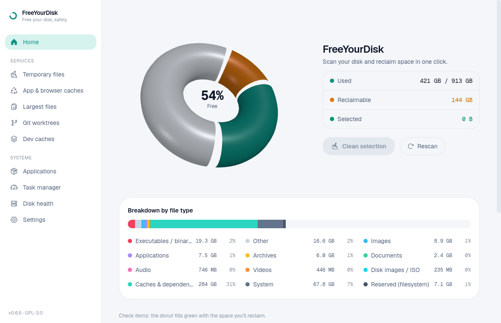
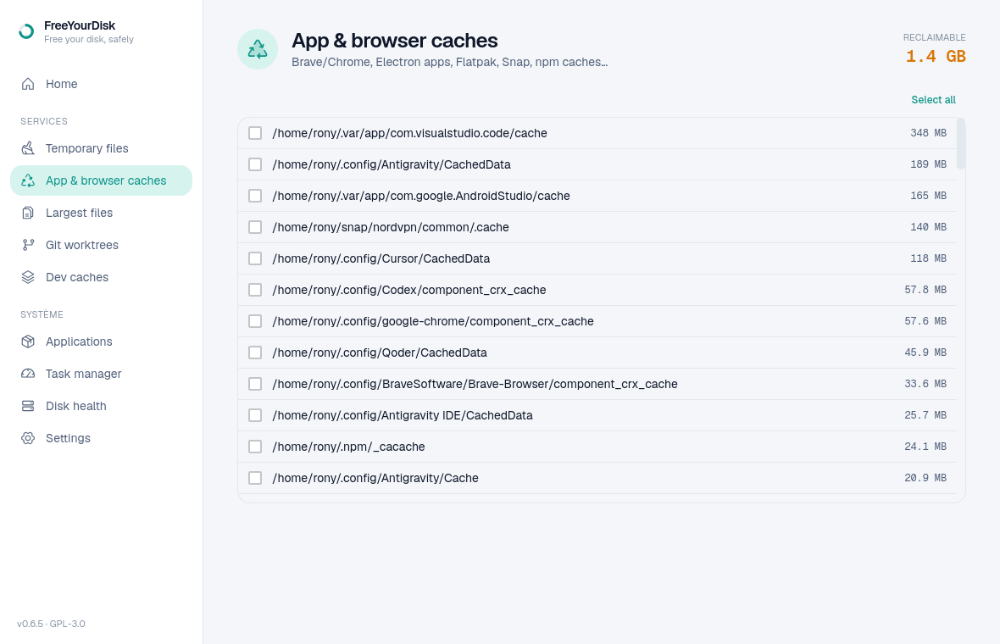
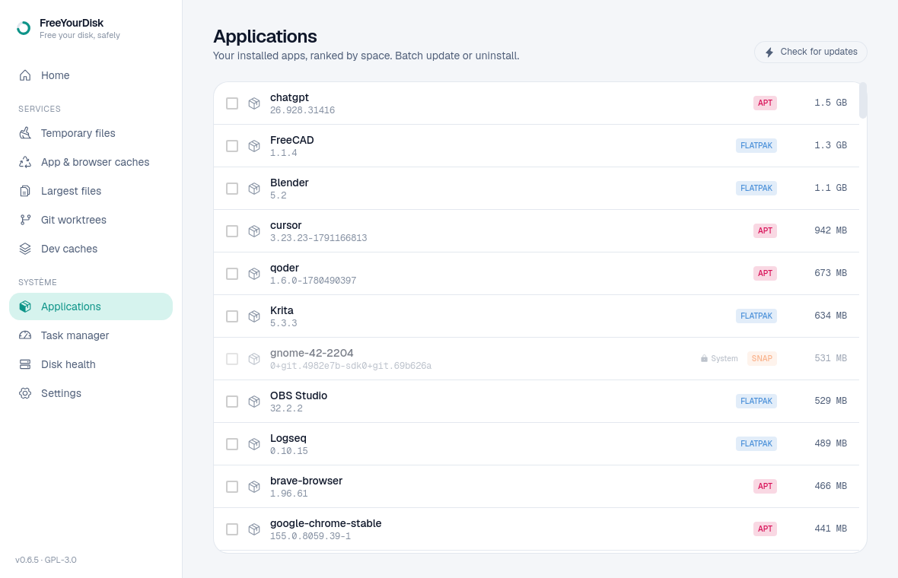

# FreeYourDisk

> Free your disk, safely.

**English** · [Français](README.fr.md)

A modern **Linux, Windows and macOS** desktop utility that scans your disk and
**safely** reclaims space: temporary files, oversized files, stale git
worktrees, developer caches, **installed applications** and a **file-type
breakdown** — around a 3D usage donut, with a recoverable-by-default deletion
model.

Built with **Tauri** (Rust core + WebView), licensed **GPL-3.0-or-later**.



These screenshots show the English interface of FreeYourDisk 0.6.5 installed
from its `.deb` package on Debian Linux, captured from the desktop application.

---

## Features

### Home — one-click unified scan

- A **3D usage donut** (three.js) showing used / reclaimable / free space.
- **Scan now** launches all cleanup scans + the file-type breakdown at once and
  fills the donut: a **gold** layer for reclaimable space and a **green** layer
  that grows as you select items, with live figures.
- Results are grouped by category (collapsible); the global "reclaimable" total
  always equals the sum of the categories and never exceeds the disk.

### Cleanup categories

- **Temporary files** — `/tmp`, `/var/tmp` and `~/.cache`, aggregated per cache
  folder and filtered by age.
- **Largest files & folders** — a read-only explorer of what takes the most
  space (cache/app folders excluded — they have their own sections).
- **Git worktrees** — prunable or clean linked worktrees. **Never touches a
  worktree with uncommitted changes.**
- **Dev caches** — `node_modules`, Rust `target/`, `.next`, `.turbo`, `.venv`,
  PHP `vendor/` and more.
- **App & browser caches** — the regenerable caches the `~/.cache` sweep misses:
  Chromium/Electron caches under `~/.config`, Flatpak (`~/.var/app/*/cache`),
  Snap and npm/yarn/bun caches.



### Breakdown by file type

A clickable distribution bar that accounts for the **whole disk**: images,
videos, audio, archives, disk images / ISO, applications, executables,
documents, **caches & dependencies**, **system** and **reserved (filesystem)**.
Click a category to list its largest files with full paths. The system figure is
measured accurately (via `du`: hardlink-deduplicated, block-accurate,
single-filesystem) so reserved ext4 blocks are shown honestly rather than
inflating "system".

### Applications

Inventory of installed apps from Linux package managers and AppImages, Windows
registry/MSIX entries, and macOS `.app` bundles. Opening the view reads that
local inventory only: it does not recursively size application folders or run a
package-manager update scan. This keeps the view responsive even when an app
folder contains many files. Such folders remain listed with an uncalculated
size; package-manager entries retain their available metadata.

Select **Check for updates** to explicitly run a live update scan. Available
updates are surfaced with their provider and versions: on Linux, **apt**,
**flatpak**, and **snap**; on Windows, exact-id **winget**; and on macOS,
Homebrew formulas and casks. AppImages and manually copied `.app` bundles
remain visible with an explicit reason, but have no deceptive update action
because they lack a standard safe update channel. Essential system packages are
**protected** (update-only, uninstall blocked). App folders are excluded from
the other scans.



### Disk health

Per-disk SMART (health, power-on hours, temperature) via **nvme-cli** for NVMe
drives (or `smartctl` for SATA), plus **real-time read/write throughput graphs**
and system uptime. Missing tools are detected per machine and can be installed in
**one click** via your package manager (apt / dnf / pacman / zypper).

### Task manager

A built-in crisis process manager: a **real-time CPU / RAM / swap graph**, a
**per-core utilization heatmap**, CPU **temperature**, and a sortable, filterable
**process table** with terminate / force-kill / restart and a one-click
**panic-kill** of the biggest non-critical memory hog. A **configurable global
hotkey** (default `Ctrl+Alt+Delete`) raises the window onto the task manager; the
app raises its own priority and requests OOM immunity to stay responsive under
memory pressure.

### Settings, scheduling & monitoring

- **Light / dark / system** theme and **French / English / system** language.
- **Launch at startup** (XDG autostart).
- **Low-disk-space monitor** — a background watcher raises a popup with a clean
  CTA when free space drops below a configurable threshold.
- **Scheduled cleanup** — a weekly systemd user timer.

### Incremental & instant

- A persisted, **mtime-validated directory-size cache**: unchanged trees
  (`node_modules`, caches) are not re-walked, so rescans are fast.
- On launch the app shows the **last results instantly** from cache, then
  refreshes in the background and **highlights what is new** since last time.

### System tray

When the desktop exposes a compatible system tray, its menu opens a popover
widget with a disk-usage summary and a quick action. If the tray is unavailable
(for example on some Linux desktop sessions), FreeYourDisk still starts and
closing the main window closes it normally rather than hiding it indefinitely.

## Safety model

FreeYourDisk is built around five non-negotiable invariants:

1. **Read-only scans** — scanning never modifies the filesystem (enforced by tests).
2. **Dry-run first** — every deletion shows an exact preview (count, size,
   destination) and requires explicit confirmation.
3. **Trash by default** — files go to the recoverable XDG trash; permanent
   deletion is an explicit, per-action opt-in.
4. **Zone whitelist** — deletions are validated against allowed zones; paths
   outside them and symlinks escaping them are refused.
5. **Git-safe** — git actions never remove uncommitted work.

### Least privilege

The UI runs as a normal user with **no privileges**. When an action needs
elevation (e.g. `/var/tmp`, SMART, or managed packages), a **minimal helper**
is invoked by the platform mechanism: Polkit / `pkexec` on Linux, UAC on
Windows, and the native administrator dialog on macOS. The WebView itself never
runs as root or administrator.

## Tech stack

| Layer      | Choice                                                                                |
| ---------- | ------------------------------------------------------------------------------------- |
| App shell  | Tauri 2 (Rust core + WebView)                                                         |
| Backend    | Rust workspace (`core-scan`, `core-trash`, `core-services`, `core-ipc`, `privhelper`) |
| Frontend   | Svelte 5 + TypeScript + Vite 6                                                        |
| Styling    | Tailwind CSS v4 (CSS-first `@theme`, light/dark)                                      |
| Charts     | Apache ECharts (graphs) + three.js (3D donut)                                         |
| Privileges | Polkit / `pkexec` + dedicated helper binary                                          |

## Build from source

### Prerequisites (Debian / Ubuntu)

```bash
sudo apt install -y libwebkit2gtk-4.1-dev build-essential curl wget file \
  libxdo-dev libssl-dev libayatana-appindicator3-dev librsvg2-dev libgtk-3-dev cmake
# Recommended for the Disk health section:
sudo apt install -y nvme-cli smartmontools
# Rust (https://rustup.rs) and Node 22+ / pnpm are also required.
cargo install tauri-cli
```

### Run in development

```bash
cd ui && pnpm install && cd ..
cargo build --release -p freeyourdisk-helper   # the privileged helper (SMART, root deletes)
cargo tauri dev
```

### Build a release / .deb / .rpm / .AppImage

```bash
cd ui && pnpm build && cd ..
cargo build --release -p freeyourdisk-helper
cargo tauri build          # produces deb, rpm and AppImage bundles
```

The standalone binary is at `target/release/freeyourdisk`.

### Prerequisites (Windows 10 1803+ / 11 · x64)

[WebView2](https://developer.microsoft.com/en-us/microsoft-edge/webview2/) is
required (pre-installed on Windows 11; the NSIS setup installs it automatically
on Windows 10). Rust ([rustup.rs](https://rustup.rs)) and Node 22+ / pnpm are
also required.

```bash
# Recommended for the Disk health section:
winget install smartmontools          # puts smartctl on PATH
```

**Installing from a release:** download the `*-setup.exe` (unsigned NSIS
installer) from the [Releases](../../releases) page. Windows SmartScreen may
warn "Unknown publisher" — click **More info → Run anyway** to proceed.

**Platform differences vs Linux:** privileged cleanup (system paths such as
`%WINDIR%\Temp`) prompts a **UAC elevation** dialog instead of Polkit /
`pkexec`. Scheduled cleanup uses a weekly **Task Scheduler** task instead of a
systemd user timer.

### Build a release / .exe installer (Windows)

```bash
pnpm --dir ui install && pnpm --dir ui build
cargo tauri build --bundles nsis       # produces the NSIS installer
```

### Release artifacts — v0.6.5

[Release v0.6.5](https://github.com/QrCommunication/FreeYourDisk/releases/tag/v0.6.5)
was published on 7 October 2026 after the release pipeline passed. All six
artifacts below are available. Each public download was verified to return
HTTP 200 with a SHA-256 hash matching its published GitHub asset metadata.

| Platform | Artifact | Notes |
| --- | --- | --- |
| Linux | `.deb` | Debian/Ubuntu package. |
| Linux | `.rpm` | RPM-based distribution package. |
| Linux | `.AppImage` | Portable application image with the privileged helper included. |
| Windows | NSIS `*.exe` | Windows installer. |
| macOS Apple Silicon | `*_aarch64.dmg` | Signed and notarized CI artifact. |
| macOS Intel | `*_x86_64.dmg` | Signed and notarized CI artifact. |

The AppImage requires `pkexec` and a running Polkit authentication agent on the
host for privileged actions. SMART features and application updates depend on
the host's installed SMART tools and package managers. Unlike the DEB/RPM
packages, the AppImage does not install a system-wide Polkit policy or a
systemd cleanup timer.

For the macOS build, signing and notarization run in the GitHub `production`
environment after the privileged helper has been embedded and signed. See
[the macOS build guide](docs/BUILD_MACOS.md) for the two native architectures
and the required release secrets.

## Project layout

```
crates/
  core-ipc/        shared DTOs (the back/front contract)
  core-scan/       read-only scanning + persisted mtime dir-size cache
  core-trash/      XDG trash + permanent delete, zone whitelist
  core-services/   the cleanup services (temp, app/browser caches, big files,
                   git worktrees, dev caches)
  privhelper/      minimal privileged helper (deletes + SMART, via Polkit)
src-tauri/         Tauri app: commands, file-type & app inventory, health,
                   low-space monitor, tray, scheduling
ui/                Svelte frontend (home/3D donut, categories, applications,
                   health, settings)
```

## Changelog

See [CHANGELOG.md](CHANGELOG.md).

## License

[GPL-3.0-or-later](LICENSE).
